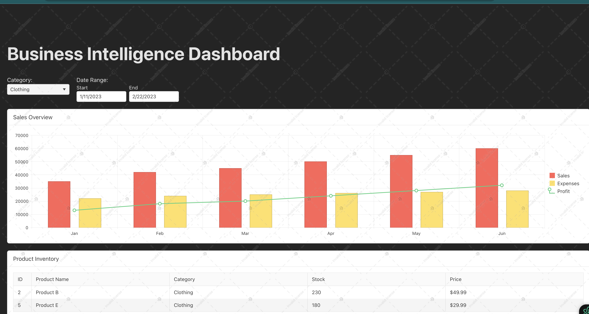
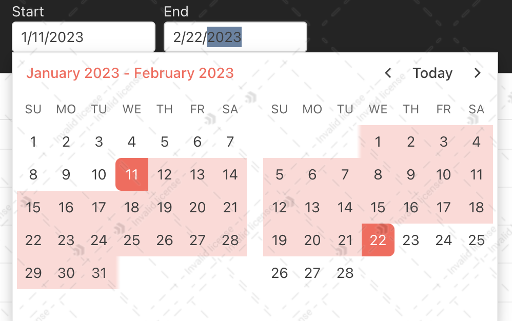
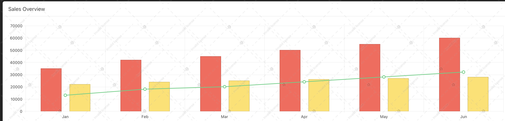
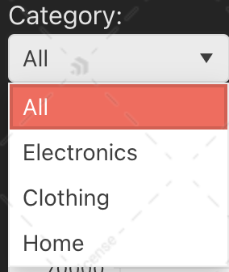
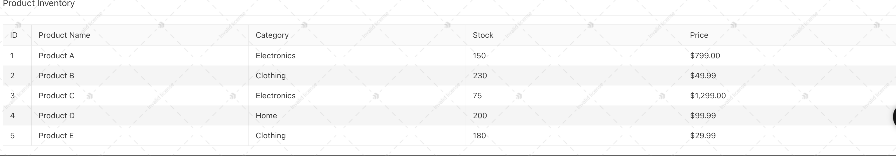

# React + Vite

This template provides a minimal setup to get React working in Vite with HMR and some ESLint rules.

Currently, two official plugins are available:

- [@vitejs/plugin-react](https://github.com/vitejs/vite-plugin-react/blob/main/packages/plugin-react/README.md) uses [Babel](https://babeljs.io/) for Fast Refresh
- [@vitejs/plugin-react-swc](https://github.com/vitejs/vite-plugin-react-swc) uses [SWC](https://swc.rs/) for Fast Refresh

## Expanding the ESLint configuration

If you are developing a production application, we recommend using TypeScript and enable type-aware lint rules. Check out the [TS template](https://github.com/vitejs/vite/tree/main/packages/create-vite/template-react-ts) to integrate TypeScript and [`typescript-eslint`](https://typescript-eslint.io) in your project.
# KendoReact BI Dashboard

A modern business intelligence dashboard built with React and KendoReact UI components, providing interactive data visualization and analysis tools.




# Components usage




## Features

- **Interactive Charts**: Visualize sales, expenses, and profit data with column and line charts
- **Data Grid**: Browse and filter product inventory data
- **Filtering Capabilities**: Filter data by category and date range
- **Responsive Design**: Optimized for both desktop and mobile devices
- **Modern UI**: Clean, professional interface using KendoReact components

  ## Live Demo

You can see the finished project here:
- [Live Demo on GitHub Pages](https://madzimai.github.io/kendoreact-bi-dashboard/)
- [Play with the Code on CodeSandbox](https://codesandbox.io/p/github/madzimai/kendoreact-bi-dashboard/draft/xenodochial-moore?workspaceId=ws_AVcieWU3iYTzCVGWMowF2j)


## Installation

```bash
# Clone the repository
git clone https://github.com/madzimai/kendoreact-bi-dashboard.git

# Navigate to project directory
cd kendoreact-bi-dashboard

# Install dependencies
npm install

# Start development server
npm run dev
#install kendoreact components
npm install @progress/kendo-react-charts @progress/kendo-drawing @progress/kendo-react-grid @progress/kendo-react-dropdowns @progress/kendo-react-dateinputs @progress/kendo-react-layout @progress/kendo-react-intl @progress/kendo-licensing @progress/kendo-theme-default

# Chart
- The dashboard uses KendoReact Charts to visualize sales data:

<Chart style={{ height: 300 }}>
  <ChartCategoryAxis>
    <ChartCategoryAxisItem categories={salesData.map(item => item.month)} />
  </ChartCategoryAxis>
  <ChartSeries>
    <ChartSeriesItem type="column" data={salesData.map(item => item.sales)} name="Sales" />
    <ChartSeriesItem type="column" data={salesData.map(item => item.expenses)} name="Expenses" />
    <ChartSeriesItem type="line" data={salesData.map(item => item.profit)} name="Profit" />
  </ChartSeries>
</Chart>

#Data Grid
- The product inventory is displayed using KendoReact Grid:
<Grid data={filteredProducts}>
  <GridColumn field="id" title="ID" width="50px" />
  <GridColumn field="name" title="Product Name" />
  <GridColumn field="category" title="Category" />
  <GridColumn field="stock" title="Stock" />
  <GridColumn field="price" title="Price" format="{0:c}" />
</Grid>

#Filters
- The dashboard implements filters using KendoReact DropDownList and DateRangePicker:
<DropDownList
  data={categories}
  value={selectedCategory}
  onChange={(e) => setSelectedCategory(e.value)}
/>

<DateRangePicker
  value={range}
  onChange={(e) => setRange(e.value)}
/>


   


